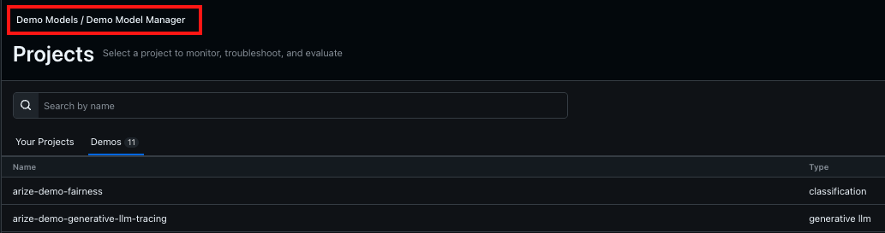

<div align="center">
  
</div>

<div align="center">

[](https://github.com/duncankmckinnon/arize_toolkit/actions/workflows/test.yml)
[](https://github.com/duncankmckinnon/arize_toolkit/actions/workflows/docs.yml)
[](https://github.com/duncankmckinnon/arize_toolkit/actions/workflows/publish.yml)
[](https://github.com/duncankmckinnon/arize_toolkit/actions/workflows/lint.yml)
[](https://www.python.org)
[](https://github.com/astral-sh/uv)
[](https://github.com/psf/black)
[](https://coverage.readthedocs.io)
[](https://duncankmckinnon.github.io/arize_toolkit/cli/)

</div>

## 📚 Documentation

### Quick Links

- [**Home**](https://duncankmckinnon.github.io/arize_toolkit) - Main documentation page
- [**Quickstart Guide**](https://duncankmckinnon.github.io/arize_toolkit/quickstart) - Get started quickly with Arize Toolkit
- [**CLI Reference**](https://duncankmckinnon.github.io/arize_toolkit/cli/) - Command-line interface documentation

### Tools Documentation

| Tool Category | Description |
|--------------|-------------|
| [**Project/Model Tools**](https://duncankmckinnon.github.io/arize_toolkit/model_tools) | Access and manage projects/models, retrieve performance metrics and traces/inference volumes |
| [**Monitor Tools**](https://duncankmckinnon.github.io/arize_toolkit/monitor_tools) | Create, copy, and manage monitors and alerting |
| [**Custom Metrics Tools**](https://duncankmckinnon.github.io/arize_toolkit/custom_metrics_tools) | Create and manage custom metrics |
| [**Language Model Tools**](https://duncankmckinnon.github.io/arize_toolkit/language_model_tools) | Work with prompts, annotations, evaluations, and LLM features |
| [**Space & Organization Tools**](https://duncankmckinnon.github.io/arize_toolkit/space_and_organization_tools) | Navigate and manage spaces, organizations, and projects |
| [**Data Import Tools**](https://duncankmckinnon.github.io/arize_toolkit/data_import_tools) | Import data from cloud storage and databases |
| [**Dashboard Tools**](https://duncankmckinnon.github.io/arize_toolkit/dashboard_tools) | Create and manage dashboards |
| [**Utility Tools**](https://duncankmckinnon.github.io/arize_toolkit/utility_tools) | Client configuration and utility functions |

### Extensions

| Extension | Description |
|-----------|-------------|
| [**Prompt Optimization**](https://duncankmckinnon.github.io/arize_toolkit/extensions/prompt_optimization) | Automated prompt improvement based on historical performance |

### For Developers

- [**Development Guide**](https://duncankmckinnon.github.io/arize_toolkit/developers/development) - Information about extending the toolkit
- [**Integration Tests**](https://duncankmckinnon.github.io/arize_toolkit/developers/integration_test) - Running integration tests
- [**Claude Code Skills**](https://duncankmckinnon.github.io/arize_toolkit/developers/claude_code_skills) - AI-assisted development workflows

#### Claude Code Skills

This repository includes [Claude Code](https://claude.ai/claude-code) skills for AI-assisted development:

| Skill | Description |
|-------|-------------|
| `arize-graphql-analytics` | Query and explore the Arize GraphQL API, build and validate queries |
| `new-query-workflow` | Complete workflow for adding new queries/mutations with models, types, tests, and docs |

Use `/arize-graphql-analytics` or `/new-query-workflow` in Claude Code to invoke these skills.

## Disclaimer

Although this package is used for development work with and within the Arize platform, it is not an Arize product.
It is a open source project developed and maintained by an Arize Engineer. Feel free to add issues or reach out for help in the Arize community Slack channel.

## Overview

Arize Toolkit is a set of tools packaged as a Python client that lets you easily interact with Arize AI APIs.
Here's a quick overview of the main features in the current release:

- Access and manage models
- Retrieve performance metrics over a time period
- Retrieve inference volume over a time period
- Create, copy, and manage custom metrics
- Create, copy, and manage monitors and alerting
- Work with LLM features like prompts and annotations
- Import data from cloud storage (S3, GCS, Azure) and databases (BigQuery, Snowflake, Databricks)
- Create, update, and delete data import jobs with full lifecycle management
- **Prompt Optimization Extension** (optional): Automatically optimize prompts using meta-prompt techniques with feedback from evaluators
- **Command-Line Interface** (optional): Manage all Arize resources directly from the terminal with Rich table output and JSON mode

## Installation

```bash
pip install arize_toolkit
```

### Optional Dependencies

#### Command-Line Interface

To use the `arize_toolkit` CLI, install with the `cli` extras:

```bash
pip install arize_toolkit[cli]
```

#### Prompt Optimization Extension

For automated prompt optimization using meta-prompt techniques, install with the `prompt_optimizer` extras:

```bash
pip install arize_toolkit[prompt_optimizer]
```

## Command-Line Interface

The CLI wraps all `Client` functionality so you can manage models, monitors, prompts, and more directly from the terminal.

### Quick Start

```bash
# One-time setup — saves credentials to ~/.arize_toolkit/config.toml
arize_toolkit config init

# List models (Rich table output by default)
arize_toolkit models list

# Same thing, using the "projects" alias
arize_toolkit projects list

# JSON output, pipe to jq
arize_toolkit --json models list | jq '.[].name'

# Get monitor details for a specific model
arize_toolkit monitors get "accuracy-alert" --model "fraud-detection-v3"

# Create a performance monitor
arize_toolkit monitors create-performance "accuracy-alert" \
    --model "fraud-detection-v3" \
    --environment production \
    --performance-metric accuracy \
    --threshold 0.95

# Use a named profile for a different environment
arize_toolkit --profile staging spaces list
```

### Global Options

| Flag | Description |
|------|-------------|
| `--version` | Show the installed version |
| `--profile NAME` | Use a named configuration profile |
| `--json` | Output raw JSON instead of Rich tables |
| `--api-key KEY` | Override the API key |
| `--org NAME` | Override the organization |
| `--space NAME` | Override the space |
| `--app-url URL` | Override the Arize app URL |

### Command Groups

| Group | Description |
|-------|-------------|
| `config` | Manage configuration profiles (`init`, `list`, `show`, `use`) |
| `spaces` | List, create, and switch spaces |
| `orgs` | List and create organizations |
| `users` | Search users and manage space membership |
| `models` / `projects` | List models, check volume, pull performance metrics |
| `monitors` | Create, list, copy, and delete monitors |
| `prompts` | Manage prompt templates and versions |
| `custom-metrics` | Create and manage custom metrics |
| `evaluators` | Manage LLM and code evaluators |
| `dashboards` | Create and view dashboards |
| `imports` | Manage file and table import jobs |

See the full [CLI documentation](https://duncankmckinnon.github.io/arize_toolkit/cli/) for detailed usage and examples.

## Client Setup

The `Client` class is the entrypoint for interacting with the toolkit. It provides maintains the connection information for making requests to the Arize APIs, and offers a wide range of operations for interacting with models, monitors, dashboards, and more.

### API Key

To create a client, you need to provide your Arize API key. Use this reference to [get your API key](https://arize.com/docs/ax/security-and-settings/api-keys) from the Arize UI.


### Organization and Space

You will also need to provide an `organization` name and `space` name. To give some context, models are scoped to a space, and the space is scoped to an organization. These can be found by navigating to the Arize UI and looking at the upper left dropdown from the landing page. You will first select an organization from the dropdown and then pick the space from the available spaces in that organization.

For the example below, the organization is `Demo Org` and the space is `Test Space`.



### For On Prem deployments

For SaaS users, the default API endpoint is always going to be `https://api.arize.com`.
If you are using an on prem deployment of Arize, you will need to provide the `api_url` parameter.
This parameters should just be the base url of your Arize instance.
