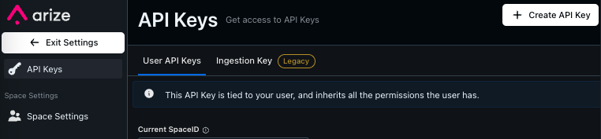

<div align="center">
  
</div>

Welcome to the documentation for Arize Toolkit, a Python client for interacting with the Arize AI API.

## Quick Links

- [Model Tools](model_tools.md) - Documentation for model tools
- [Monitor Tools](monitor_tools.md) - Documentation for monitor tools
- [Custom Metrics Tools](custom_metrics_tools.md) - Documentation for custom metrics tools
- [Language Model Tools](language_model_tools.md) - Documentation for language model tools
- [Space Tools](space_tools.md) - Documentation for space, organization, & navigation tools

## Disclaimer

Although this package is used for development work with and within the Arize platform, it is not an Arize product.
It is a open source project developed and maintained by an Arize Engineer.

## Overview

Arize Toolkit is a set of tools packaged as a Python client that lets you easily interact with Arize AI APIs.
Here's a quick overview of the main features in the current release:

- Access and manage models
- Retrieve performance metrics over a time period
- Retrieve inference volume over a time period
- Create, copy, and manage custom metrics
- Create, copy, and manage monitors and alerting
- Work with LLM features like prompts and annotations

## Installation

```bash
pip install arize_toolkit
```

## Client Setup

The `Client` class is the entrypoint for interacting with the toolkit. It provides maintains the connection information for making requests to the Arize APIs, and offers a wide range of operations for interacting with models, monitors, dashboards, and more.

### API Key

To create a client, you need to provide your Arize API key. Use this reference to [get your API key](https://docs.arize.com/arize/reference/authentication-and-security/api-keys) from the Arize UI.



### Organization and Space

You will also need to provide an `organization` name and `space` name. To give some context, models are scoped to a space, and the space is scoped to an organization. These can be found by navigating to the Arize UI and looking at the upper left path in the `Projects & Models` page. They will be in the format `organization/space`.

For the example below, the organization is `Demo Models` and the space is `Demo Model Manager`.


### For On Prem deployments

For SaaS users, the default API endpoint is always going to be `https://api.arize.com`.
If you are using an on prem deployment of Arize, you will need to provide the `api_url` parameter.
This parameters should just be the base url of your Arize instance.

### Sleep Time

The `Client` class can be configured to wait a certain amount of time between requests. This is useful to avoid rate limiting.
The default sleep time is 0 seconds. When instantiating the client, you can set the `sleep_time` parameter to the number of seconds to wait between requests. This can save time if you are making a large number or requests or getting a large amount of data. If you start seeing rate limit errors, you can increase this value. There is a helper function in the client to update the sleep time in line:

#### `set_sleep_time`

```python
from arize_toolkit import Client

client: Client = client.set_sleep_time(sleep_time: int)
```

This will update the sleep time for the existing client in line.

- **Parameters**

  - `sleep_time` – The number of seconds to wait between requests

- **Returns**

  - `Client` – The updated client

- **Example**

```python
from arize_toolkit import Client

client = Client(..., sleep_time=0)

# Update the sleep time in line
lots_of_models = client.set_sleep_time(10).get_all_models()
```

## For Developers

- [Development Guide](developers/development.md) - Information about extending the toolkit
- [Integration Tests](developers/integration_test.md) - Running integration tests
